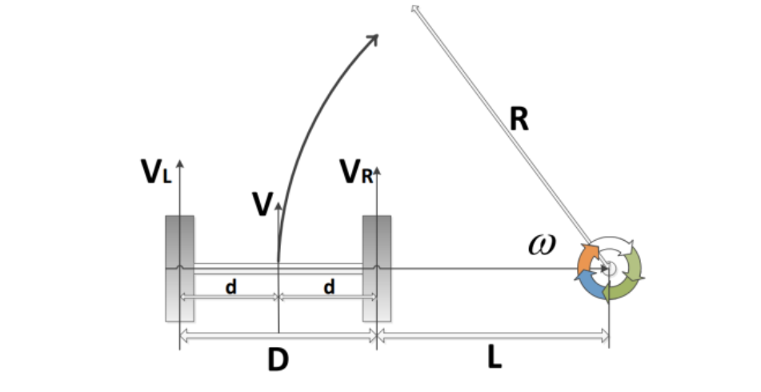

# ROS知识原理

## **UART协议** 

##  https://blog.csdn.net/sternlycore/article/details/85244515

## **三角测距法

##  https://blog.csdn.net/dgreh/article/details/83096330

## 通讯协议

https://blog.csdn.net/zhao_ke_xue/article/details/105493907

### 差分机器人模型

ROS向STM32发送左轮设定速度、右轮设定速度、预留控制位(一个字节可灵活使用)

$$
R = V / w
$$

$$
V_L = V + wd
$$

$$
V_R = V - wd
$$

STM32向ROS发送左轮实时轮速、右轮实时轮速、航向角、预留控制位(一个字节可灵活使用)。
$$
V_x = (V_L + V_R ) / 2
$$
